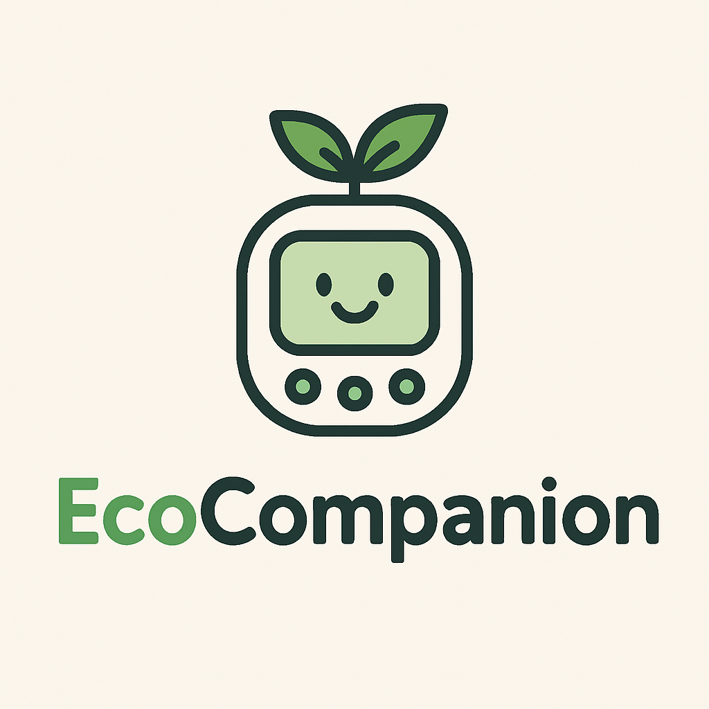

> **⚠ Repository Move Notice:** This project has moved to a new repository:  
> **[https://repos.hackathon.bz.it/2025-sfscon/team-6](https://repos.hackathon.bz.it/2025-sfscon/team-6)**  
> 
> 🏆 **Award Winner:** We're proud to announce this project won the **KONVERTO Challenge 2025**!  
> 
> 🌐 **Porject website:** Check out our project website at:  
> **[https://www.hackathon.bz.it/project/ecocompanion](https://www.hackathon.bz.it/project/ecocompanion)**

# NOI Hackaton 2025

## About

Eco Companion is a Tamagotchi-inspired gadget that motivates employees to live more sustainably. Each user has a virtual companion whose “health” reflects their eco-friendly habits—like biking to work or choosing vegetarian meals. The companion’s wellness score is displayed both digitally and physically through a small ESP32-powered device featuring a gauge driven by a stepper motor.

The project combines a Vue.js frontend for user interaction, a Node.js + Express backend with SQLite3 for data storage, and C++ firmware on the ESP32 to control the display and motor. Together, they create a fun, gamified way to encourage greener daily choices.
